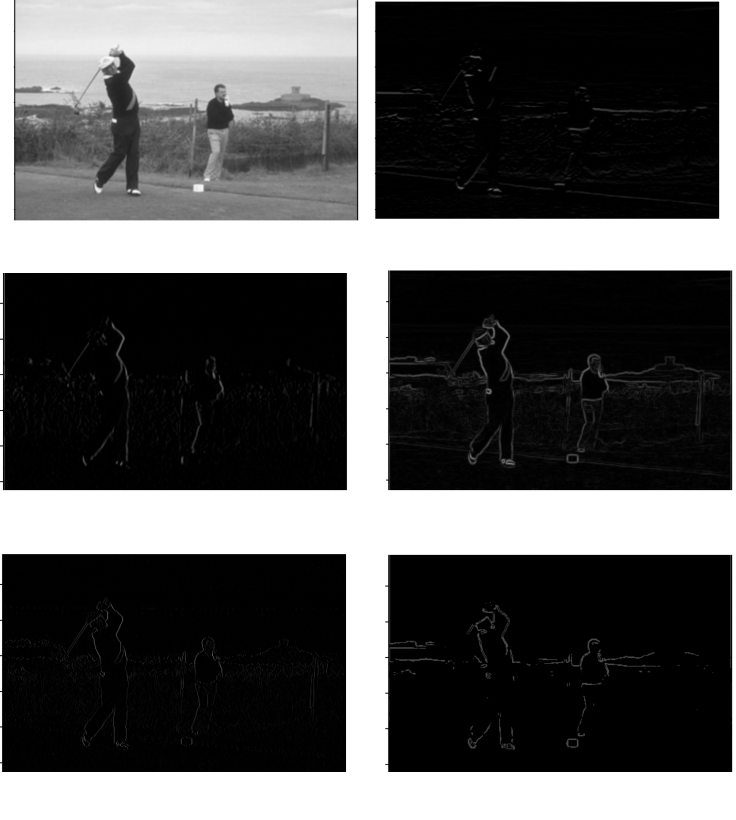
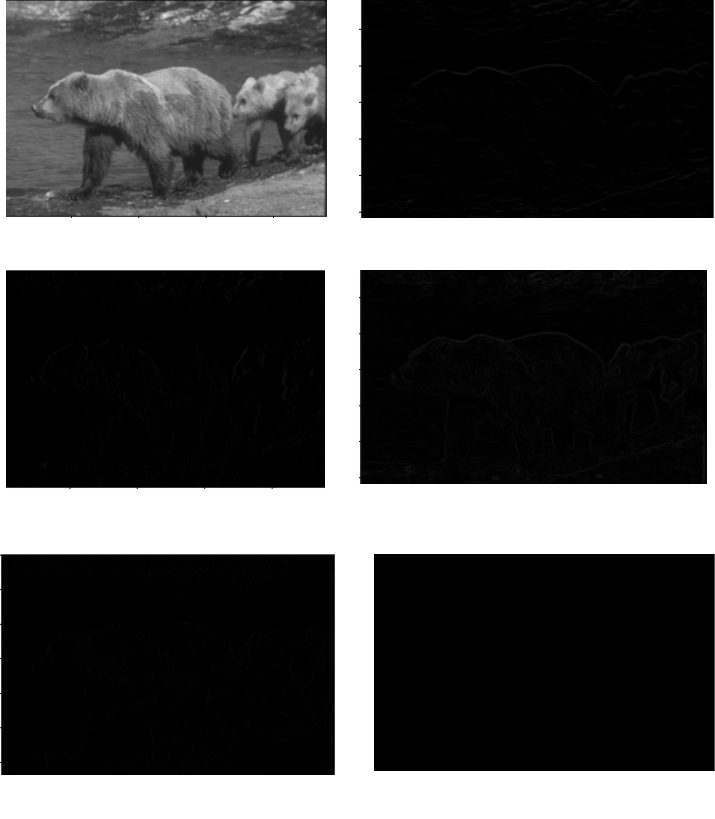
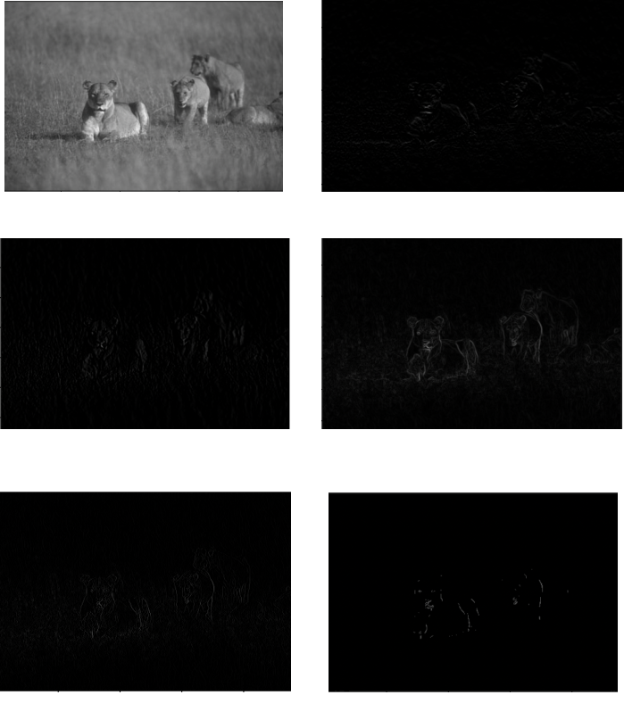

# Canny Edge Detection

I found that changing value used for sigma had a significant impact on the quality of images produced by the algorithm. For example, when I increased the sigma to 3, then it made harder to notice the effects of the all operations perform by the algrithm. When I decreased the to .5, I could still see the effects of all the operations of the algrorithm, but not as well as when I had the sigma at a value of 1. I notice I got the best results when I had the sigma at a value of 1. Below are the images of all three values I used for sigma (1, 3, .5).

## Sigma 1

## Sigma 3

## Sigma .5

